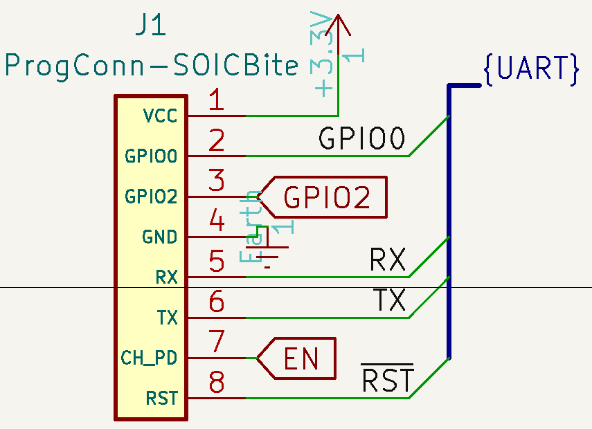

# ESP-PROG Programming Cable Adapter
Simple PCB that sits on top of the ESP-PROG and enables you to use either the SOICbite or Tag-Connect TC2050-IDC to program your ESP-based projects.
 
 
> [!NOTE]
> As of this update on 2/5/24, v1.3 is in the mail and HAS NOT BEEN TESTED. Once it is confirmed working, this notice will be removed. 
 

 
## Features
* Enables easy connecting TC-2050-IDC and SOICbite programming cables to ESP-PROG for JTAG and UART programming. 
* This enables you to use component-less programming footprints easily on your ESP-based projects (and anything using UART).
* Includes reversible UART TX/RX so if you mess it up on your board, you can easily change it on your adapter!
* All the info you need about the connector can be found in the [schematic.](files/esp-prog-adapter-v1.3-sch.pdf)

> [!NOTE]
> Schematic, BOM, Gerbers, and all other files needed for production and assembly can be found attached to the latest [release!](https://github.com/0xjmux/ESP-PROG-Adapter/releases/latest)

## Notes and Usage
* This includes an interactive HTML BOM, in case you need it for assembly. 
* Symbols to easily connect the SOICbite footprint to your custom designs can be found in [jmux-kicad-things](https://github.com/0xjmux/jmux-kicad-things)

 
Example of SOICBite UART connector symbol. 

 
## Versions
### V1.3 - Redesigned (Again)
* Added headers that allow you to easily reverse UART TX-RX in case it was mixed up on the board you're testing. Just cut the solderjumpers on the bottom of the board, add header pins to the top, and the direction is now easily changeable. 
* I hadn't checked that the symbol and footprint orientation for the SOICbite matched on 1.2, and when they arrived it didn't work. Removed the TC2050 UART connector.
* Added a SOICbite connector on the side of the board with TX-RX pins connected together, allowing you to test that the adapter & drivers are working correctly via UART loopback. 
* Added notes to the schematic to make pinouts clear for anyone reading it, so the same mistake isn't made again. Pinouts like would be needed on the board the adapter connects *to* have also been added, to make setup a breeze for anyone using the adapter, or SOICbite in general. All my custom symbols can be found in [jmux-kicad-things](https://github.com/0xjmux/jmux-kicad-things)
 
 

 
---

### V1.2 - JTAG arrives!
* Added JTAG compatibility headers, extended size of board. 
* Got the footprints wrong and waited forever to order them, they didn't work :(
* SOICbite connector wasn't oriented right. 

