# ESP32 Firmware Debugging, as Easy as Possible

One of the things I've noticed in a lot of beginner ESP32 PCBs is a lack of hardware debugging interfaces, which is understandable since setting up JTAG can be a bit confusing when you're first exposed to it. This project's goal is to make using JTAG and connector-less footprints on your PCBs as easy and cheap as possible. 

#### To get started, all you need is: 
1. An ESP-Prog, Espressif's cheap and flexible UART and JTAG adapter - [Aliexpress, ~$11 US](https://s.click.aliexpress.com/e/_DnkCFmz)
1. SOIC-8 Clip programming cable for SOICbite - [Aliexpress, ~$3](https://www.aliexpress.us/item/3256805091794484.html)
1. My adapter PCB and [connectors](#Components) ordered from your favorite PCB house ([Gerbers found under releases](https://github.com/0xjmux/ESP-PROG-Adapter/releases)) - ~$6 with connectors
1. My Kicad library (found under [ESP-EZ-Debug-KicadLib/](./ESP-EZ-Debug-KicadLib)) to easily include connector-less footprints in your Kicad designs. 

## ESP-Prog Programming Cable Adapter

Simple PCB that sits on top of the ESP-Prog to use the SOICbite and Tag-Connect TC2050-IDC adapters to program and debug ESP-based projects.
 

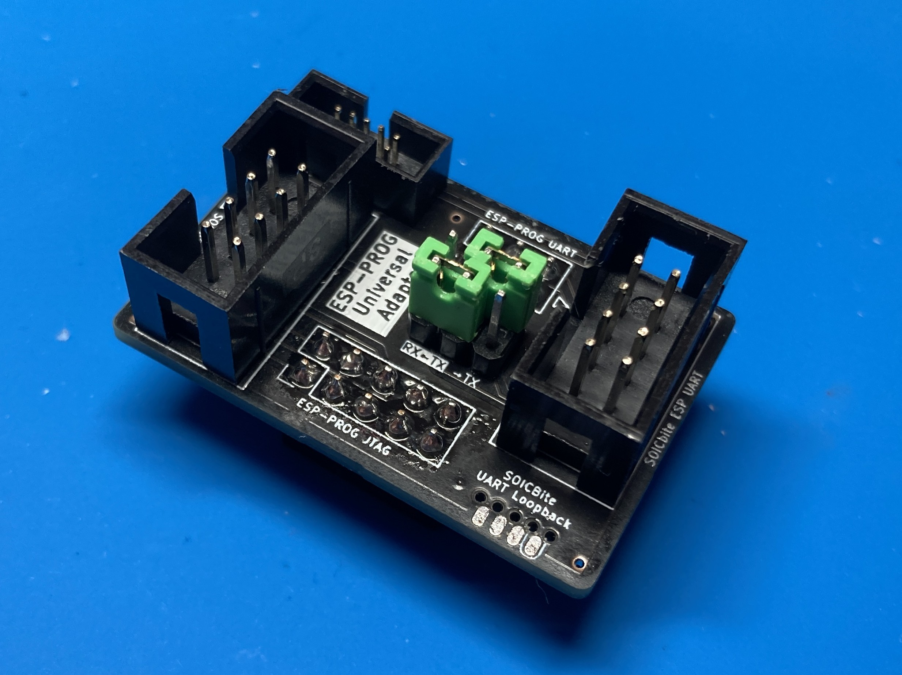
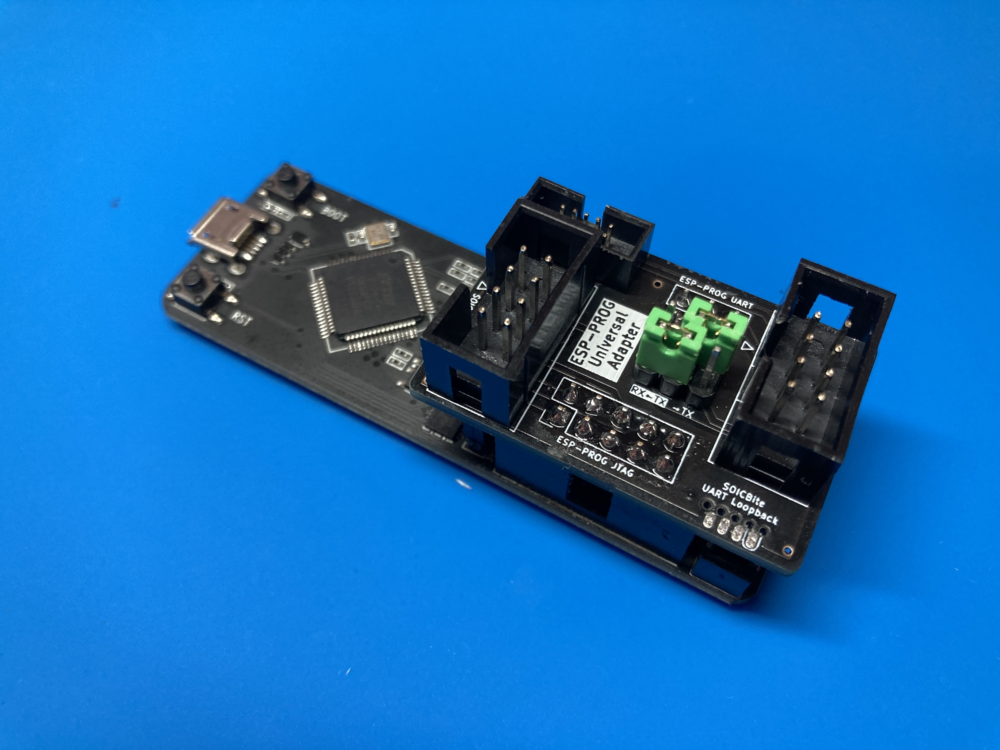

I originally made this adapter because I was in need of a hardware debugging solution for my ESP-based projects, and was tired of the dupont wire mess I needed to connect my programming cable to my JTAG adapter. 
 
## Features
* Easily connect your TC-2050-IDC and SOICbite programming cables to the ESP-Prog for JTAG and UART programming. 
    * This enables you to easily integrate component-less programming footprints with your ESP-based projects (and anything else using UART).
* Includes reversible UART TX/RX so if you mess it up on your board, you can easily change it on your adapter!
* Onboard SOICBite "loopback" footprint with TX-RX pins connected, allowing you to easily confirm UART is working. 
* Detailed [schematic](files/esp-prog-adapter-v1.3-sch.pdf) containing all info you might need about the adapter, and easy to use schematic symbols (see [jmux-kicad-things](https://github.com/0xjmux/jmux-kicad-things)) for using the connectors in your designs. 

> [!NOTE]
> Schematic, Gerbers, and all other files needed for production and assembly can be found attached to the latest [release!](https://github.com/0xjmux/ESP-PROG-Adapter/releases/latest)

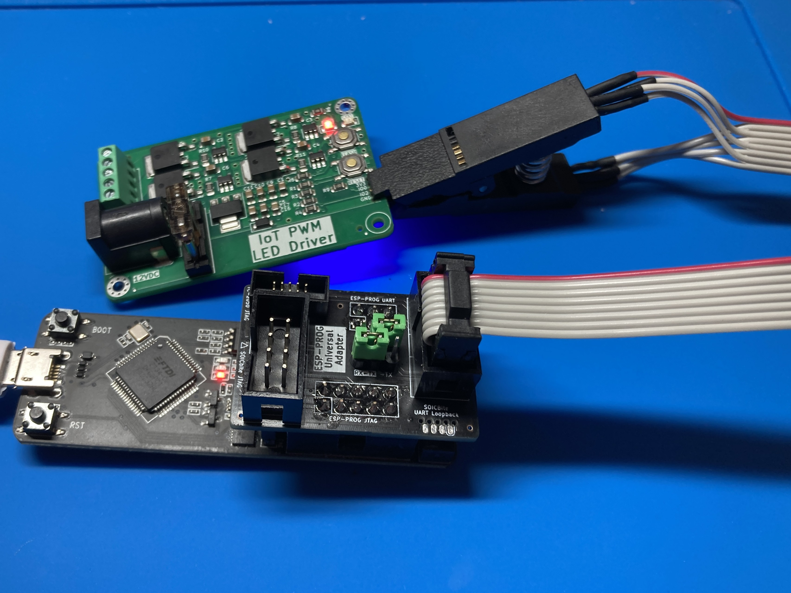
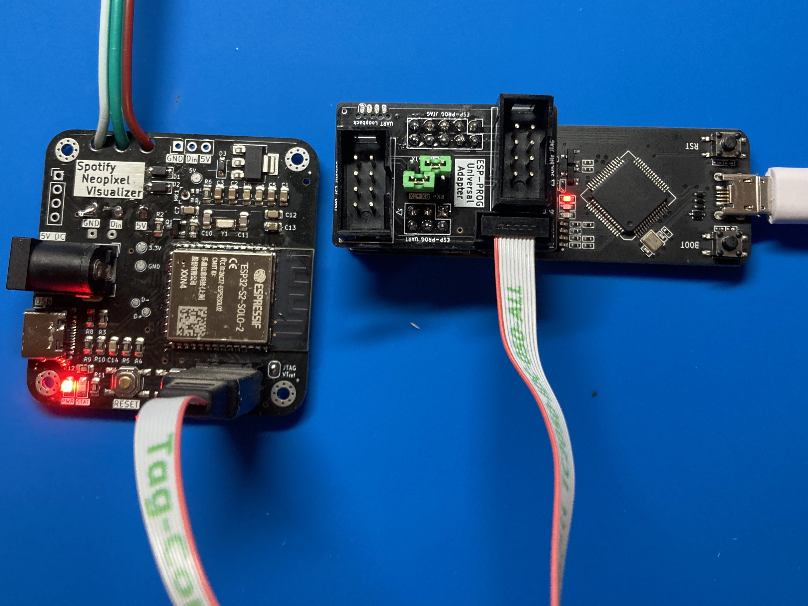
 SOICBite (left) and Tag-Connect (right) cables connected to target boards using the adapter

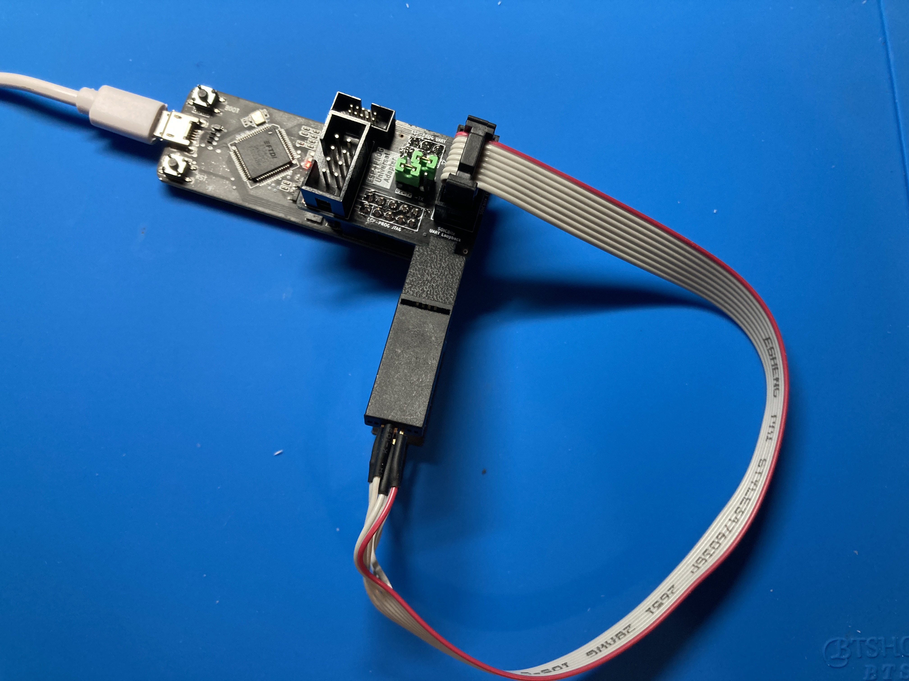
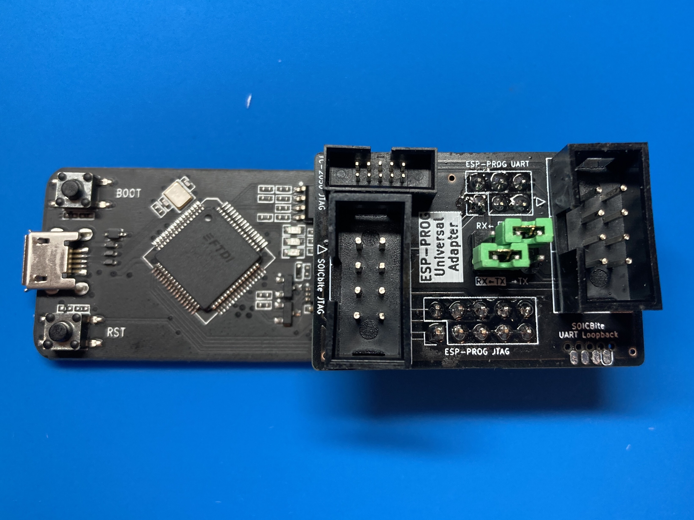
 SOICBite UART loopback usage (left) and top view of adapter on ESP-Prog (right)

## How to Use
* To make using these in your projects as easy as possible, I've created a Kicad library under `ESP-EZ-Debug-KicadLib/`. 
* These schematic symbols follow the [standard pinouts](https://github.com/SimonMerrett/SOICbite/tree/master?tab=readme-ov-file#pin-assignment) for each connector and are designed to be as self-explanatory as possible. There's an image example of connector wiring below, along with `UsageExamples.kicad_sch` so you can directly copy and paste into your designs. 

> [!NOTE]
> For information on installing and using the Kicad library, see [ESP-EZ-Debug-KicadLib/README.md](ESP-EZ-Debug-KicadLib/)

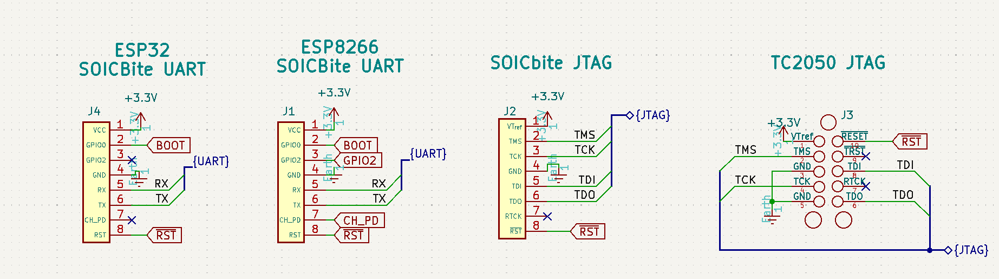 
Examples of how to wire up each connector to an ESP32

#### Software: Setting up Debugging with ESP-IDF and VSCode
* [This configuration note for the ESP-IDF VSCode extension](https://github.com/espressif/vscode-esp-idf-extension/blob/master/docs/DEBUGGING.md) is very helpful for setting up the IDE for hardware debugging
* [Espressif's documentation page on JTAG debugging for the ESP32](https://docs.espressif.com/projects/esp-idf/en/latest/esp32/api-guides/jtag-debugging/index.html#how-it-works)

## Hardware Setup/Soldering
The board comes with optional swappable UART jumpers. If this feature is not needed, simply solder the two solderjumpers (JP5 & JP6) that connect UART normally. 

> [!IMPORTANT]
> You must either bridge the solderjumpers or install the pin headers. If you don't do either, the UART interface won't be connected. 

### Components

| Component                   | Purpose                 | LCSC Part # | Link                                                                                                                                                                                       |
|-----------------------------|-------------------------|-------------|--------------------------------------------------------------------------------------------------------------------------------------------------------------------------------------------|
| 2x5P 2.54mm Female Header | ESP-Prog JTAG           | C18723056   | [LCSC](https://www.lcsc.com/product-detail/Female-Headers_HanElectricity-2541FV-2x5P_C18723056.html)                                                                                       |
| 2x3P 2.54mm Female Header | ESP-Prog UART           | C5298392    | [LCSC](https://www.lcsc.com/product-detail/span-style-background-color-ff0-Female-span-span-style-background-color-ff0-Headers-span_CJT-Changjiang-Connectors-A2541HWV-2x3P_C5298392.html) |
| 2x5P 1.27mm IDC Header      | TC2050 Conector         | C2962228    | [LCSC](https://www.lcsc.com/product-detail/IDC-Connectors_XKB-Connectivity-X1270WV-2x05A-6TV01_C2962228.html)                                                                              |
| 2x4P 2.54mm IDC Header (x2)      | SOICBite Connector      | C17179451   | [LCSC](https://www.lcsc.com/product-detail/IDC-Connectors_HanElectricity-HY2541WV-N-2x4P_C17179451.html)                                                                                    (x2) |
| 2x3P 2.54mm M Pin Header    | Reversible UART Jumpers | C2935918    | [LCSC](https://www.lcsc.com/product-detail/Pin-Headers_DEALON-DZ254R-22-06-63_C2935918.html)                                                                                               |

 

 
If you found the work I put into this valuable, I'd appreciate if you could buy me a coffee so I can continue devoting time to extensively documenting my projects like this. 

### Soldering Order
I recommend going from shortest to tallest components, starting on the top side of the PCB. This is a very approachable solder job since everything is THT, but when attaching the headers that connect to the ESP-PROG there is the potential to burn the plastic of the connectors already installed on the top. Here's the order I recommend attaching the components:

1. TC2050 IDC Socket
1. 2x3 Pin header and SOICbite socket(s)
1. Downward facing F pin headers that connect to ESP-PROG

 
## Versions
### V1.4 - Polishing it up
* All functionality confirmed working.
* PCB updated to clarify assembly and use (text enlarged, dual 1x3 headers for reversible UART changed to single 2x3P using custom symbol).
* Vdd for JTAG and UART disconnected from each other on adapter, allowing different voltage to be used for each.
* Connected nRST line of ESP-PROG (from UART header) to board RESET line on JTAG pinout with solderjumper.
* Default connected solderjumpers changed to default open for Reversible UART, since I anticipate it'll be more used than not. 

 

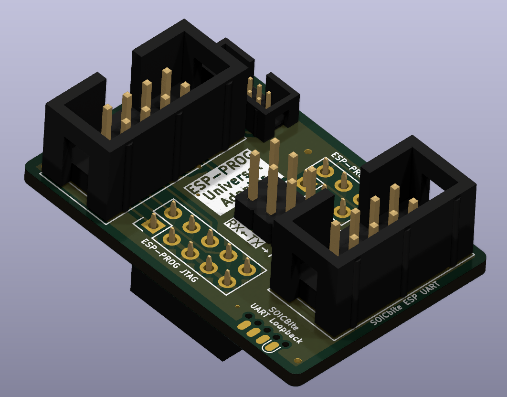
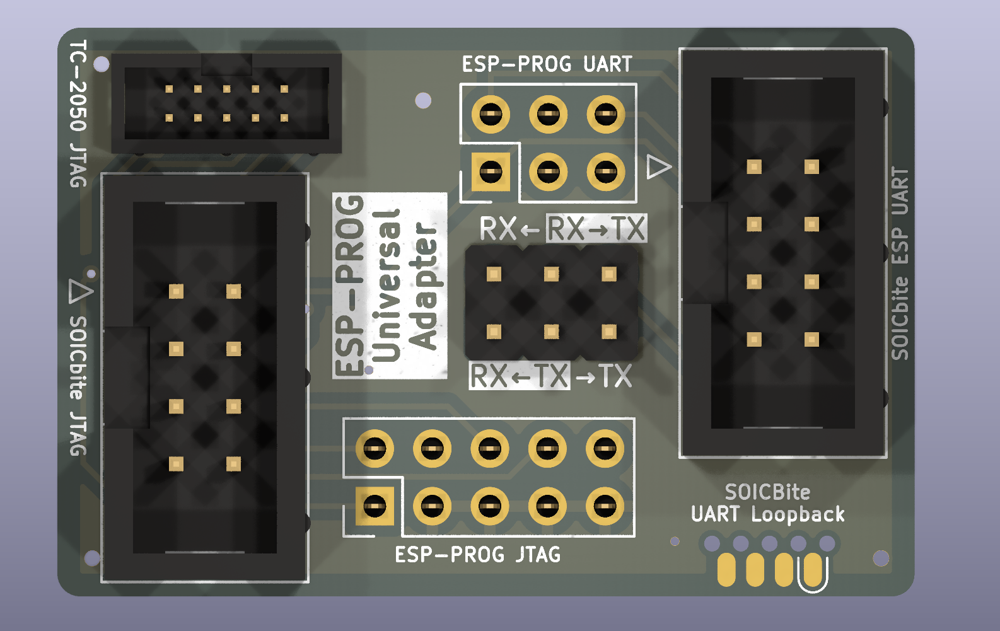
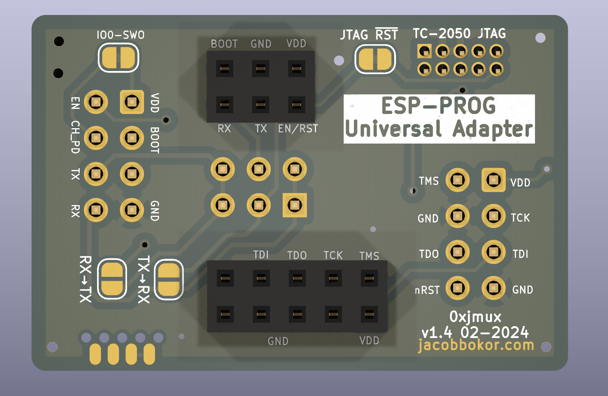
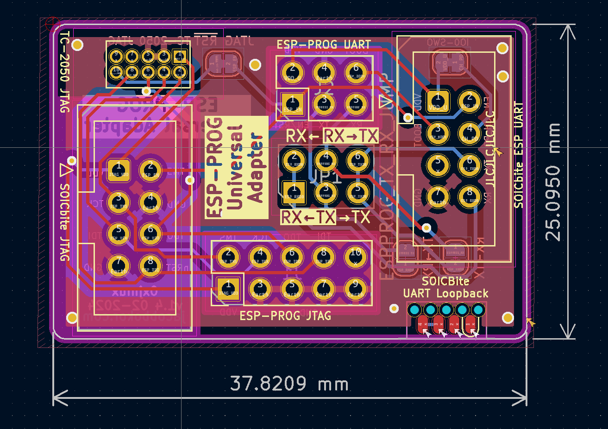

---

### V1.3 - Redesigned (Again)
* Added headers that allow you to easily reverse UART TX-RX in case it was mixed up on the board you're testing. Just cut the solderjumpers on the bottom of the board, add header pins to the top, and the direction is now easily changeable. The bolded text indicates the default direction. 
* Fix symbol and footprint orientation for SOICbite from 1.2. Removed the TC2050 UART connector.
* Added a SOICbite connector on the side of the board with TX-RX pins connected together, allowing you to test that the adapter & drivers are working correctly via UART loopback. 
* Added notes to the schematic to make pinouts clear for anyone reading it, so similar symbol/footprint orientation mistakes aren't made again.
 

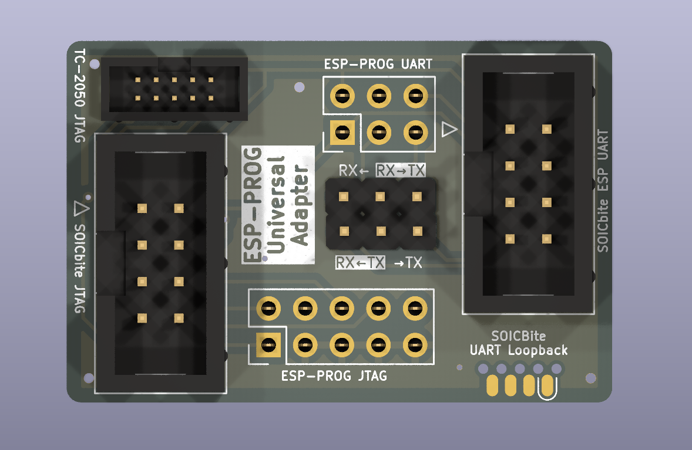
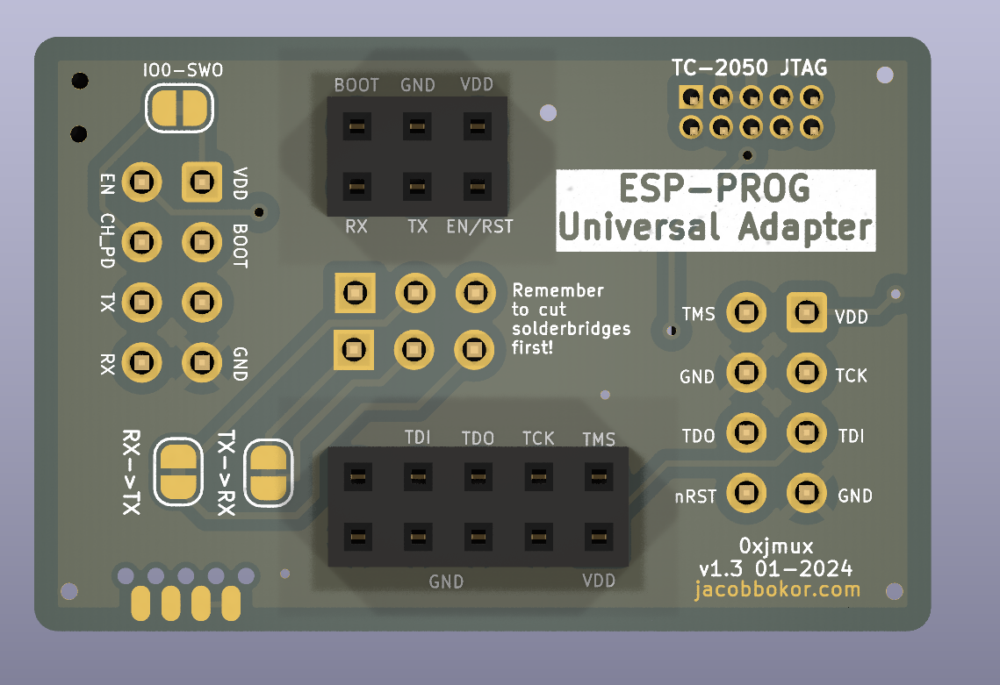
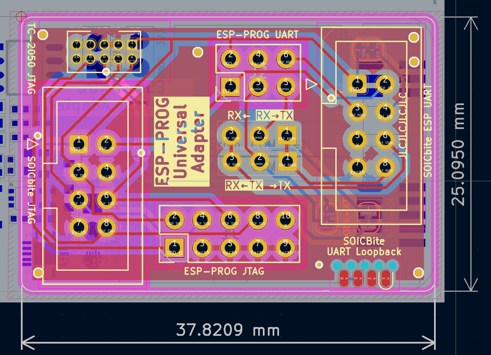

 
---

### V1.2 - JTAG arrives!
* Added JTAG compatibility headers, extended size of board. 
* The time between designing and ordering this version was on the order of months. Once I ordered it, I realized I had mixed up the pin ordering on the footprints, and needed to modify the schematic. 
* SOICbite connector wasn't oriented right. 

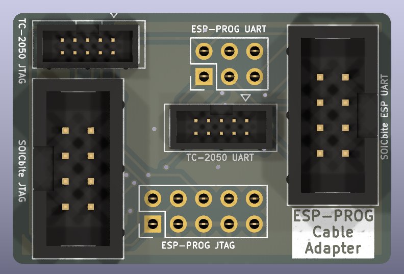
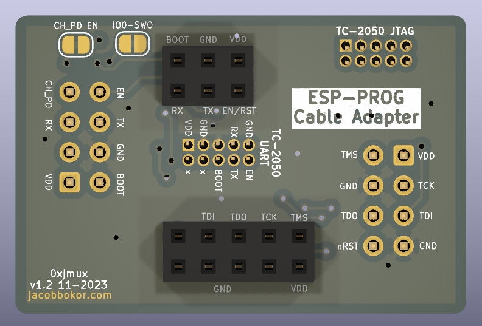
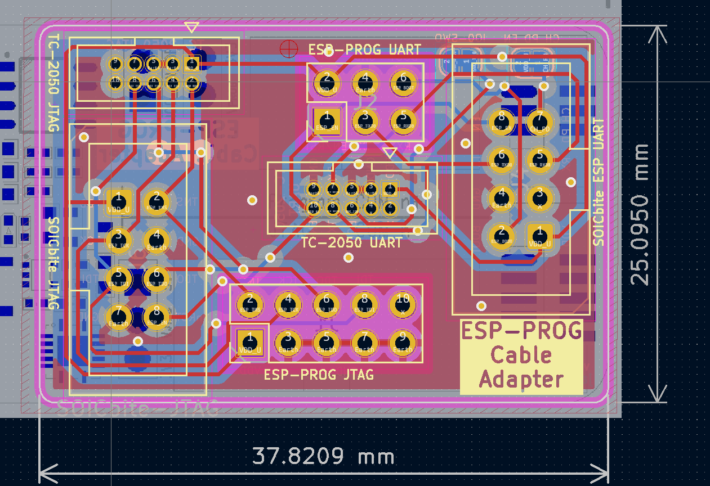

---

## References
* This project was inspired by BrechtVE's very cool [Universal J-Link adapter](https://github.com/Fescron/universal-jlink-adapter), which I was originally planning on using. Segger's discontinuation of the J-Link EDU left me in search of other options since the EDU mini doesn't support the ESP's Xtensa LX7 architecture, which is how I landed on the ESP-Prog.

---

The goal here is to make the joy of firmware debugging as easy to approach as possible; if you have any suggestions, please feel free to open a PR. 

 

 

