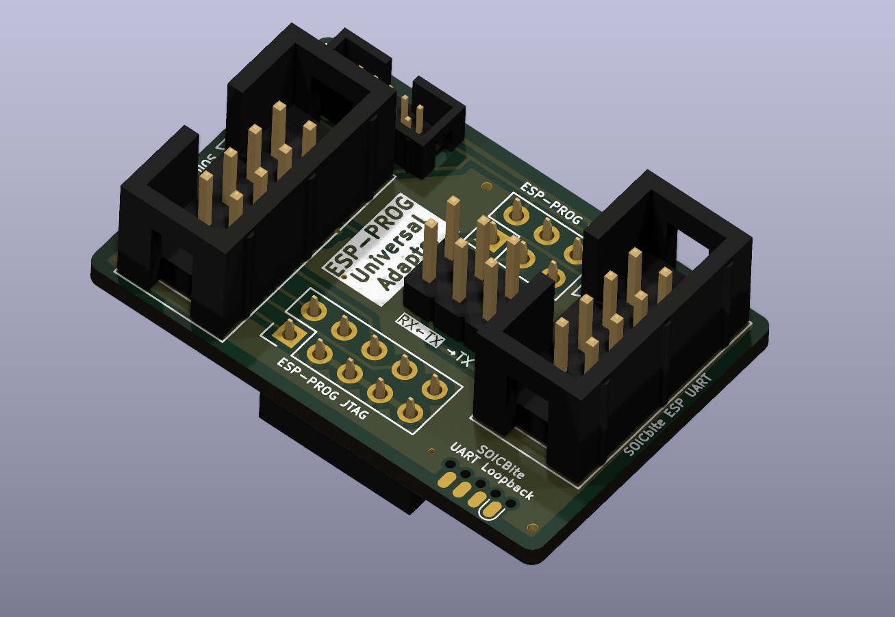

# ESP-PROG Programming Cable Adapter

Simple PCB that sits on top of the ESP-Prog and enables you to use either the SOICbite or Tag-Connect TC2050-IDC to program your ESP-based projects.
 

I made this because I was in need of a hardware debugging solution for my ESP-based projects, and was tired of the dupont wire mess I needed to connect my programming cable to my adapter.
 
## Features
* Easily connect your TC-2050-IDC and SOICbite programming cables to the ESP-PROG for JTAG and UART programming. 
    * This enables you to easily integrate component-less programming footprints with your ESP-based projects (and anything else using UART).
* Includes reversible UART TX/RX so if you mess it up on your board, you can easily change it on your adapter!
* Onboard SOICBite "loopback" footprint with TX-RX pins connected, allowing you to easily confirm UART is working. 
* Detailed [schematic](files/esp-prog-adapter-v1.3-sch.pdf) containing all info you might need about the adapter, and easy to use schematic symbols (see [jmux-kicad-things](https://github.com/0xjmux/jmux-kicad-things)) for using the connectors in your designs. 

> [!NOTE]
> Schematic, Gerbers, and all other files needed for production and assembly can be found attached to the latest [release!](https://github.com/0xjmux/ESP-PROG-Adapter/releases/latest)

 SOICBite (left) and Tag-Connect (right) cables connected to target boards using the adapter

 SOICBite UART loopback usage (left) and top view of adapter on ESP-Prog (right)

## Notes and Usage
* I've created symbols to easily integrate the SOICBite and Tag-Connect within your ESP32-based projects, which can be found in [jmux-kicad-things](https://github.com/0xjmux/jmux-kicad-things). These schematic symbols follow the standard pinouts for each connector and are designed to be as self-explanatory as possible. 

 
Example of SOICBite UART connector symbol. 

## Hardware Setup/Soldering
The board comes with optional swappable UART jumpers. If this feature is not needed, simply solder the two solderjumpers (JP5 & JP6) that connect UART normally. 

> [!NOTE]
> IMPORTANT: You MUST either bridge the solderjumpers or install the pin headers. If you don't, the UART interface won't be connected. 

### Components

| Component                   | Purpose                 | LCSC Part # | Link                                                                                                                                                                                       |
|-----------------------------|-------------------------|-------------|--------------------------------------------------------------------------------------------------------------------------------------------------------------------------------------------|
| 2x5P 2.54mm Female Header | ESP-Prog JTAG           | C18723056   | [LCSC](https://www.lcsc.com/product-detail/Female-Headers_HanElectricity-2541FV-2x5P_C18723056.html)                                                                                       |
| 2x3P 2.54mm Female Header | ESP-Prog UART           | C5298392    | [LCSC](https://www.lcsc.com/product-detail/span-style-background-color-ff0-Female-span-span-style-background-color-ff0-Headers-span_CJT-Changjiang-Connectors-A2541HWV-2x3P_C5298392.html) |
| 2x5P 1.27mm IDC Header      | TC2050 Conector         | C2962228    | [LCSC](https://www.lcsc.com/product-detail/IDC-Connectors_XKB-Connectivity-X1270WV-2x05A-6TV01_C2962228.html)                                                                              |
| 2x4P 2.54mm IDC Header (x2)      | SOICBite Connector      | C17179451   | [LCSC](https://www.lcsc.com/product-detail/IDC-Connectors_HanElectricity-HY2541WV-N-2x4P_C17179451.html)                                                                                    (x2) |
| 2x3P 2.54mm M Pin Header    | Reversible UART Jumpers | C2935918    | [LCSC](https://www.lcsc.com/product-detail/Pin-Headers_DEALON-DZ254R-22-06-63_C2935918.html)                                                                                               |

 

 
If you found the work I put into this valuable, I'd appreciate if you could buy me a coffee so I can continue devoting time to extensively documenting my projects like this. 

### Soldering Order
I recommend going from shortest to tallest components by height, PCB top side first. This is a very approachable solder job since everything is THT, but when attaching the headers that connect to the ESP-PROG there is the potential to burn the plastic of the connectors already installed on the top. Here's the order I recommend attaching the components:

1. TC2050 IDC Socket
1. 2x3 Pin header and SOICbite socket(s)
1. Downward facing F pin headers that connect to ESP-PROG

 
## Versions
### V1.4 - Polishing it up
* All functionality confirmed working.
* PCB updated to clarify assembly and use (text enlarged, dual 1x3 headers for reversible UART changed to single 2x3P using custom symbol).
* Vdd for JTAG and UART disconnected from each other on adapter, allowing different voltage to be used for each.
* Connected nRST line of ESP-PROG (from UART header) to board RESET line on JTAG pinout with solderjumper.
* Default connected solderjumpers changed to default open for Reversible UART, since I anticipate it'll be more used than not. 

 

### V1.3 - Redesigned (Again)
* Added headers that allow you to easily reverse UART TX-RX in case it was mixed up on the board you're testing. Just cut the solderjumpers on the bottom of the board, add header pins to the top, and the direction is now easily changeable. The bolded text indicates the default direction. 
* Fix symbol and footprint orientation for SOICbite from 1.2. Removed the TC2050 UART connector.
* Added a SOICbite connector on the side of the board with TX-RX pins connected together, allowing you to test that the adapter & drivers are working correctly via UART loopback. 
* Added notes to the schematic to make pinouts clear for anyone reading it, so similar symbol/footprint orientation mistakes aren't made again.
 

 
---

### V1.2 - JTAG arrives!
* Added JTAG compatibility headers, extended size of board. 
* Got the footprints wrong and waited forever to order them, they didn't work :(
* SOICbite connector wasn't oriented right. 

## References
* This project was inspired by BrechtVE's very cool [Universal J-Link adapter](https://github.com/Fescron/universal-jlink-adapter), which I was originally planning on using. Segger's discontinuation of the J-Link EDU left me in search of other options since the EDU mini doesn't support the ESP's Xtensa LX7 architecture, which is how I landed on the ESP-Prog.
